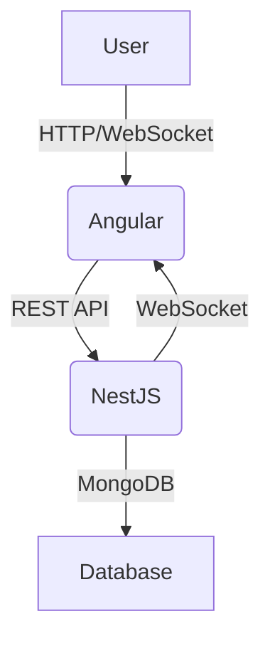

# Project Management App Assessment

## Overview
A full-stack project management application with real-time, user-specific notifications. Built with NestJS (backend), Angular (frontend), and MongoDB. Features include project CRUD, authentication, role-based access, and a modern, responsive UI with real-time notification delivery.

---

## How to Run & Test
- Start backend and frontend as above
- Register/login as different users (Admin/Viewer)
- Create/update/delete projects to trigger notifications
- Mark notifications as read/delete; verify persistence and per-user state
- Test on desktop and mobile for responsive UI

## Run project
- git clone ( repo link )
- npm install on frontend and backend files
- ng serve -o for run frontend
- npm run start:dev for run backend

---

## Assessment Approach
1. **Understand Requirements:**
   - Persistent, user-specific notifications (read/unread/delete per user)
   - Real-time updates (WebSocket)
   - Modern, responsive UI (no x-axis scroll, glassmorphism, etc.)
2. **Design Solution:**
   - Backend: Use MongoDB for notifications, track per-user state with `readBy`/`deletedBy` arrays
   - Frontend: Only show backend notifications, ensure all actions use valid ObjectIds
   - UI: Responsive, scroll-free, and visually appealing
3. **Implement & Test:**
   - Refactor backend and frontend as needed
   - Test all notification flows, UI responsiveness, and error handling

---

## Solution Summary
- **User-specific notifications:**
  - Each notification tracks which users have read or deleted it (`readBy`, `deletedBy` arrays)
  - No global read state; all actions are per-user
- **Persistence:**
  - Only backend-stored notifications persist across reloads
- **Real-time updates:**
  - WebSocket (Socket.IO) delivers notifications instantly to all connected clients
- **Validation & Error Handling:**
  - DTOs use class-validator for robust API validation
  - Frontend checks for valid ObjectIds before API calls

---

## Architecture

- **Frontend:** Angular, Material UI, RxJS, Socket.IO-client
- **Backend:** NestJS, Mongoose, Socket.IO, JWT Auth
- **Database:** MongoDB

## Key Features
- Project CRUD with role-based access (Admin/Viewer)
- Real-time, user-specific notifications (read/unread/delete)
- Secure authentication (JWT)
- Robust error handling and validation
